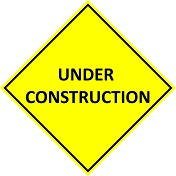

**This web site is under construction!!!**

This site is a repository for the research by James R. Bradley and A. Paul Blossom.  In particular,
it provides ancillary content that could not be included in the articles.  Our research contained
herein is focused on generating adversarial examples for neural networks and using those adversarial 
examples for:

- Measuring neural network robustness
- Adversarial training
- Advancing fairness and equity of the application of neural networks by considering the human persepctive

Each paper has its own landing page, which contains links to the associated content:

1. [Generating Adversarial Examples for Visual Similarity, Counterfactuals, and the Measurement of Robustness](/gae_ga/)

